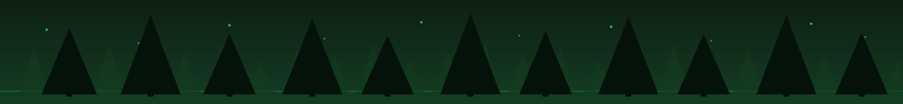
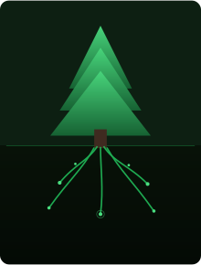
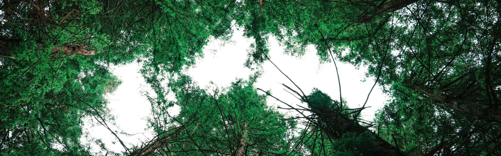
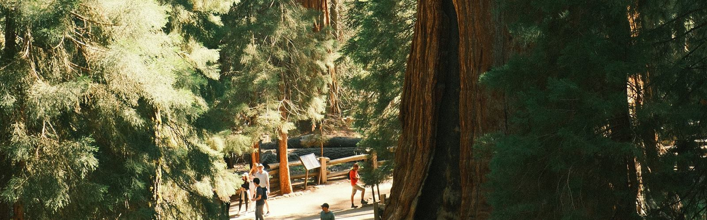
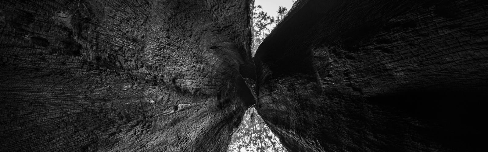
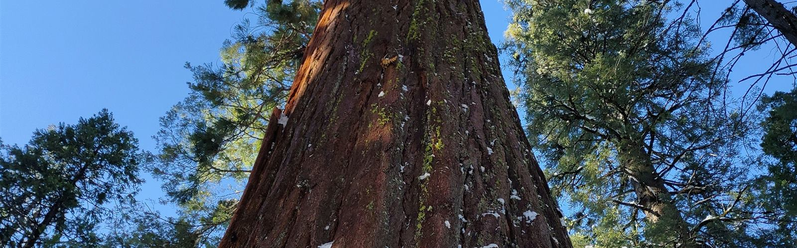
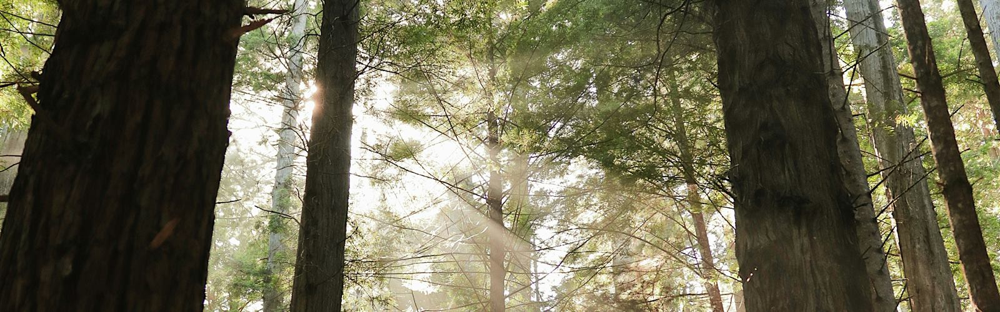
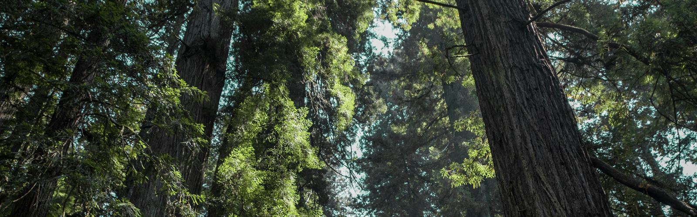
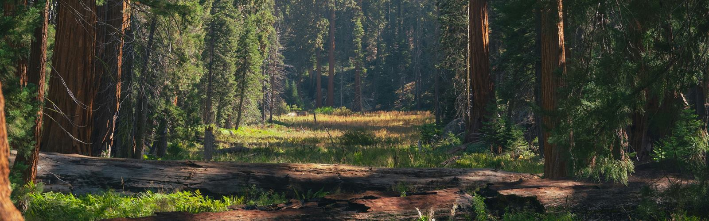
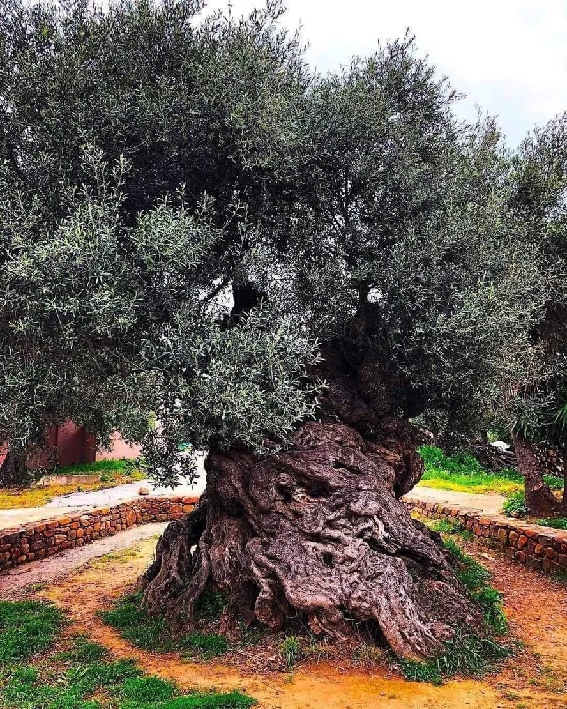

<!-- ============================================================ -->
<!-- HEADER / BANNER — edite texto, gradiente e altura aqui -->
<!-- ============================================================ -->

<!-- TYPING ANIMATION — edite as frases em "lines=" -->

<!-- ============================================================ -->
<!-- SOBRE MIM — edite o texto de apresentação aqui -->
<!-- ============================================================ -->

  <table>
    <tr>
      <td width="230" align="center" valign="middle">
        
      </td>
      <td valign="middle">
        <h3>🌲 Raízes profundas, crescimento constante</h3>
        

          Sou <strong>Alerson</strong>, desenvolvedor fullstack e fundador da <strong>Genesis Code</strong> —
          uma iniciativa de desenvolvimento e soluções com IA. Estou em formação como
          <strong> Secure Fullstack Developer</strong>: construo com HTML, CSS, Javascript, Node.js, React, TypeScript e PostgreSQL,
          e trago para dentro do código a mesma disciplina que aplico ao estudar segurança ofensiva e defensiva.
        

        

          Assim como a sequoia leva séculos para crescer e ainda assim resiste ao fogo e à tempestade,
          acredito em construir devagar, com raiz funda: em fé, em código, em caráter.
          Cada sistema que escrevo é também um muro que aprendo a levantar — como Neemias reconstruindo
          Jerusalém, tijolo por tijolo, com a ferramenta em uma mão e vigilância na outra.
        

      </td>
    </tr>
  </table>

- 🌱 Formação: Fullstack (Node.js · React · TypeScript · PostgreSQL · Docker)
- 🛡️ Trilha paralela: Cibersegurança e Ethical Hacking, autodidata
- 📍 Volta Redonda, RJ, Brasil
- 🚀 Aberto a estágios, freelas e colaborações

<!-- FAIXA DE FOTO: copa da floresta (recorte de foto do Unsplash) -->

<!-- ============================================================ -->
<!-- STACK E FERRAMENTAS — adicione/remova badges aqui -->
<!-- ============================================================ -->

### 🌐 Stack Fullstack

### 🛡️ Segurança

<!-- ============================================================ -->
<!-- PROJETOS EM DESTAQUE — edite descrições e links aqui -->
<!-- ============================================================ -->

### 🌳 Projetos em destaque

<table>
  <tr>
    <td width="50%" valign="top">
      <h3>💰 FinTrack</h3>
      

        App fullstack de finanças pessoais com <strong>insights via IA (Gemini)</strong>,
        autenticação <strong>JWT</strong>, cache com <strong>Redis</strong> e pipeline de
        <strong> CI/CD</strong>. Pensado para transformar dado financeiro em decisão.
      

      
    </td>
    <td width="50%" valign="top">
      <h3>🦷 Sistema para Clínica Odontológica</h3>
      

        Site institucional + backend em <strong>Node.js/PostgreSQL</strong> com
        <strong> criptografia AES</strong>, painel administrativo em <strong>React</strong>,
        geração de PDFs, recepcionista com <strong>IA no WhatsApp</strong> e
        conformidade com a <strong>LGPD</strong>.
      

      
    </td>
  </tr>
  <tr>
    <td colspan="2" align="center" valign="top">
      <h3>🌱 Próxima muda</h3>
      
<em>Reservado para o próximo projeto plantado nesta floresta.</em>

    </td>
  </tr>
</table>

<!-- FAIXA DE FOTO: sequoia gigante com pessoas na base -->

<!-- ============================================================ -->
<!-- ESTATÍSTICAS — troque "dev-alef" pelo seu usuário se mudar -->
<!-- ============================================================ -->

### 📊 Estatísticas

<!--
  VERSÃO COM PALETA VERDE-FLORESTA CUSTOMIZADA (github-readme-stats):
  o servidor público oficial está pausado. Se um dia você hospedar sua
  própria instância na Vercel (gratuito), troque SEU-DOMINIO abaixo pelo
  domínio do seu deploy, apague a primeira e a última linha deste bloco
  e remova as duas imagens acima.

-->

<!-- FAIXA DE FOTO: troncos de sequoia marcados pelo fogo (P&B) -->

<!-- ============================================================ -->
<!-- TRILHA DE CIBERSEGURANÇA — edite seu usuário do TryHackMe -->
<!-- ============================================================ -->

### 🛡️ Jornada Ethical Hacking

**OverTheWire** → **TryHackMe** → **PortSwigger Academy** → **Hack The Box** → **Bug Bounty**

*A sequoia atravessa o incêndio por causa da espessura da casca. Segurança é isso: construir sistemas de casca grossa — e cada camada começa com disciplina diária.*

<!--
  BADGE DO TRYHACKME: quando criar sua conta, troque SEU_USUARIO_THM
  pelo seu nome de usuário nas DUAS ocorrências abaixo e apague a
  primeira e a última linha deste bloco para o badge aparecer.

-->

<!-- FAIXA DE FOTO: tronco de sequoia contra o céu azul -->

<!-- ============================================================ -->
<!-- ALÉM DO CÓDIGO — edite livros, música e sonhos aqui -->
<!-- ============================================================ -->

### 🌌 Além do código

- ✍️ **Autor publicado** de livros sobre amor, ego e fé — *"Uma voz que clama por verdade"*
- 🎻 **Músico**: Eterno aprendiz de violoncelo, violão e flauta
- 🌲 **Meta**: caminhar entre as sequoias da Califórnia
- 🕊️ **Meta**: pisar a Terra Santa

<!-- FAIXA DE FOTO: luz do sol atravessando a floresta (antes do versículo) -->

<!-- ============================================================ -->
<!-- VERSÍCULO — fechamento espiritual -->
<!-- ============================================================ -->

> *"O temor do SENHOR é o princípio da sabedoria, e o conhecimento do Santo é a inteligência."*
> — **Provérbios 9:10**

<!-- FAIXA DE FOTO: copas verdes das sequoias -->

<!-- ============================================================ -->
<!-- CONTATO — substitua os placeholders pelos seus links -->
<!-- ============================================================ -->

### 📬 Contato

<!-- FAIXA DE FOTO: clareira entre as sequoias -->

<!-- ============================================================ -->
<!-- SNAKE ANIMATION — gerado por .github/workflows/snake.yml -->
<!-- Requer: Actions com permissão de leitura/escrita habilitada -->
<!-- ============================================================ -->

<picture>
  <source media="(prefers-color-scheme: dark)" srcset="https://raw.githubusercontent.com/dev-alef/dev-alef/output/github-contribution-grid-snake-dark.svg" />
  <source media="(prefers-color-scheme: light)" srcset="https://raw.githubusercontent.com/dev-alef/dev-alef/output/github-contribution-grid-snake.svg" />
  
</picture>

<!-- ============================================================ -->
<!-- OLIVEIRA — sinal da volta de Jesus -->
<!-- ============================================================ -->

> *"Naquele dia, estarão os seus pés sobre o monte das Oliveiras..."*
> — **Zacarias 14:4**

*Ele voltará.*

<!--
  Créditos das fotos (Unsplash): Sebastian Matamala, Ryan Arnst,
  Launde Morel, Yuky Y., Ludwig Theodor von Rühm, Joey Graziano,
  Aiden, Alan Labisch.
-->
